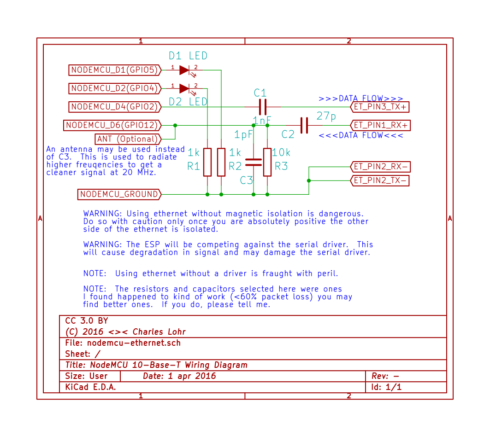

# espthernet

*It's pronounced "e-s-peethernet" - a party trick, not a legitimate engineering solution.*

ESP8266 + I2S = Software-based 10-Base-T Ethernet Driver

For a detailed overview of how this project works, please see the [Hackaday article](http://hackaday.com/2016/04/01/ethernet-controller-discovered-in-the-esp8266/).  For a rough idea of what's going on, checkout the youtube video:

## Overall Discussion

This is a relatively unreliable and coincidentally functional ESP8266 Ethernet driver.  It only uses two pins on the ESP, the I2S pins, but does provide Ethernet.  It does all its own manchester encoding/decoding, framing, FCS, etc.  It mimics the ENC424J600 stack found in [avrcraft](http://github.com/cnlohr/avrcraft) and borrows the IP, ARP, UDP and TCP stacks from that project, too.

This product was created by Charles Lohr, but, will likely fall out of support by original author quickly.  Additional contributers would be welcome.

The frontend [i2sduplex.c](user/i2sduplex.c) is what takes the bits off wire and calls a callback in an interrupt with raw 32-bit words of what came in from the wire.  It also accepts buffers to send raw bits out on the wire.

Though designed for the ESP8266 should be relatively portable, as most of the code is limited to [manchestrate.c](user/manchestrate.c) and related files.  Since it is designed to operate at full duplex, it is expecting a 40MHz-in, and 40MHz-out stream.  This stream mus be biased toward 0's instead of 1's since at 40MHz-in there are ambiguous bit patterns if you don't bias.  This takes on raw on-wire bits and puts out ethernet frames - or accepts frames and outputs raw on-wire bits.

From there, we can check the FCS and process the packets in a consistent way and have a way of interacting with buffers. [net_compat.c](etherhelp/net_compat.c) is what handles all of that.  The interface it provides mimics the ENC424J600 and is what is used in avrcraft.  The reason I use that interface on so many projects is because the style of memory access and use makes it require less buffers and less copying than stacks like lwip.

For the user layer, this system just borrows everything from avrcraft, including the http server!  You will notice that it's a little awkward since it's designed to operate with either the TCP/IP stack from Espressif OR the avrcraft TCP/IP server.  It would be really cool if we could figure out some way to have consistent entry.

## The Web Interface

There is a web interface that gets put on the ESPs with a "make" step from the "web" directory.  It pushes the webpage to the ESP.  The webpage does not need to live on the ESP, itself, it can be viewed independent of one, it just only supports the "Load Test Packet" feature in "Last Packet" [version on github.io](http://cnlohr.github.io/espthernet/web/page/). 

The webpage is what is used to look at packets, create the demanchestration table, [demanchestrate_table.h](user/demanchestrate_table.h) and test the table on new data.  This was needed considering how complicated the decoding process is.  Without testing on data, a lot of data, coming up with a robust algorithm was almost impossible!!! One other feature in the web interface is you can click on the 1's and 0's and turn them on and off to see how the system decodes those packets.

## Hardware

Option 1: ***recommended*** Use a line driver like the ILS3371 and ethernet magnetics and terminator.  This is superior, and likely to work in many situations except with stringent hardware and long cable runs. An example can be found in the [esp12e-ethernet.pdf](hardware/esp12e-ethernet.pdf).

Option 2: ***not recommended*** Just jam some capacitors and resistors onto the input and hope for the best.  This is potentially hazardous and may not work on many devices.  Be ready to be disappointed.

Overall, just about any 10 mbit magnetics should do, and line drivers make things a lot better, especially if they have a bandwidth of 20 MHz.  Note that you absolutely must bias the incoming signal toward 0, so there will be slightly more 0's on the input stream than 1's.

## More to come?

Who knows?  Depending on how this is received I may work to improve and document it, but it was a lot of work and after months of this, I'm sick of it.

## License

This software is licensed under the 2-clause BSD license.  See "LICENSE" for more information

## Future Work
 * Switch to half-duplex option, or separate streams.  By using 20 MHz TX, and 32-36 MHz RX, you can save a lot of time since you'd have to process less data, and remove the requirement for signal bias. 
 * Add Hook to internal IP stack of whatever is being used.
 * Use FLPs instead of NLPs to negotiate for 10BaseT-FD instead of -HD  (Stack handles full duplex comms, no reason not to comm at it)
 * Use a pseudo-PLL for decoding packets rather than a transition finder.  It may be better?  Right now we monitor all transitions, instead we could look where we expect a bit transition and see what it does.
